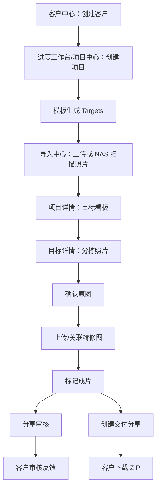

# 页面与业务流程地图

最后更新：2026-05-21

本文件按“用户能看到的页面”组织，用于快速定位页面、组件、接口和业务动作。

## 1. 页面总览

| 页面 | 前端路由 | 组件文件 | 认证 | 主要业务 |
| --- | --- | --- | --- | --- |
| 登录 | `/login` | `views/LoginView.vue` | 否 | 管理端登录 |
| 进度工作台 | `/` | `views/Dashboard.vue` | 是 | 快速查看项目、新建项目 |
| 项目中心 | `/projects` | `views/ProjectCenter.vue` | 是 | 项目列表、筛选、归档、回收站 |
| 项目详情 | `/project/:id` | `views/ProjectDetail.vue` | 是 | 目标看板、项目进度、分享审核、归档 |
| 导入中心 | `/project/:id/import` | `views/ImportCenter.vue` | 是 | NAS 扫描、照片筛选、批量标签/目标 |
| 目标详情 | 项目详情内嵌 | `components/TargetDetail.vue` | 是 | 三段式处理：原图、精修、成片 |
| 作品中心 | `/portfolio` | `views/PortfolioCenter.vue` | 是 | 跨项目作品筛选 |
| 素材中心 | `/materials` | `views/MaterialCenter.vue` | 是 | 素材上传、分类、标签筛选、预览下载 |
| 客户中心 | `/clients` | `views/ClientCenter.vue` | 是 | 客户 CRUD、客户详情 |
| 用户管理 | `/admin/users` | `views/AdminUserPanel.vue` | 管理员 | 用户 CRUD |
| 设置-基础 | `/settings/basic` | `views/SettingsBasic.vue` | 是 | 机构名、外链域名 |
| 设置-系统图库 | `/settings/images` | `views/SettingsImages.vue` | 是 | 系统图库、NAS 导入 |
| 设置-项目模板 | `/settings/templates` | `views/SettingsTemplates.vue` | 是 | 模板、目标词典 |
| 设置-标签 | `/settings/tags` | `views/SettingsTags.vue` | 是 | 全局标签 |
| 设置-用户 | `/settings/users` | `views/SettingsUsers.vue` | 管理员 | 用户与项目权限 |
| 客户审核页 | `/share/:token` | `views/ReviewPage.vue` | 否 | 客户看图、确认、反馈 |
| 客户交付页 | `/delivery/:token` | `views/DeliveryPage.vue` | 否 | 客户下载 ZIP |

## 2. 主业务流程

## 3. 页面到 API 速查

### 登录

- `POST /api/v1/auth/login`
- `GET /api/v1/auth/me`
- `PUT /api/v1/auth/me/password`

注意：旧路径 `/api/v1/system/auth/login` 已废弃，任何页面不得再调用。

### 进度工作台 / 项目中心

- `GET /api/v1/projects`
- `POST /api/v1/projects`
- `PATCH /api/v1/projects/{id}`
- `POST /api/v1/projects/{id}/archive`
- `POST /api/v1/projects/{id}/unarchive`
- `POST /api/v1/projects/{id}/soft-delete`
- `GET /api/v1/clients`
- `GET /api/v1/settings/templates`

### 项目详情 / 目标看板

- `GET /api/v1/projects/{id}`
- `GET /api/v1/projects/{id}/targets`
- `POST /api/v1/projects/{id}/targets`
- `PATCH /api/v1/projects/{id}/targets/{target_id}`
- `DELETE /api/v1/projects/{id}/targets/{target_id}`
- `GET /api/v1/projects/{id}/available-targets`
- `POST /api/v1/projects/{id}/dictionary-entry`

### 导入与分拣

- `GET /api/v1/projects/{id}/photos`
- `GET /api/v1/projects/{id}/photos/shot-dates`
- `POST /api/v1/photos/scan-nas`
- `GET /api/v1/photos/scan-nas/{task_id}/status`
- `PATCH /api/v1/photos/bulk-update`
- `POST /api/v1/photos/bulk-soft-delete`
- `POST /api/v1/photos/bulk-add-tags`
- `POST /api/v1/photos/bulk-remove-tags`

分拣交互约定：`PhotoShuttle.vue` 用于目标详情内的子项目整理，左侧来源支持“未分类/项目内”，右侧为当前目标状态池；`ImportCenter.vue` 的快速分拣用于按日期、标签、状态筛选后批量分配到目标，并在分配前显示选中数量和移入状态。两处批量移动均使用固定缩略图尺寸和滚动选择，移动成功后应提供一次撤销入口。

场景图子项目约定：`category_type=scene` 的目标详情顶部展示“场景目标图”和“场景空场景”。两者从项目照片中选择；场景目标图可选择多张，不做版本迭代；空场景每次重新选择都会生成新版本并保留历史。精修图分类为 `generated`（生成图）、`generated_4k`（4K生成图）、`high_res`（高清图）。同一次多选上传精修图共用 `retouch_batch_id`，详情页按批次显示当次迭代图片和备注。最终图必须通过管理端上传并关联一张精修图，形成 `最终图 -> 精修图 -> 原图` 的单链路。目标卡片未手动设置样图时，按最新完成图、精修图、原图、场景目标图的顺序自动回退展示。

客户审核精修图状态：客户可选择“确认无需修改”“继续修改”“弃用”。继续修改必须保留备注，可在大图上圈选或打字生成修改示意图；后端保存示意图路径到 `review_feedbacks.annotation_path`，管理端通过项目反馈接口展示确认状态、修改意见和示意图入口。弃用在客户页灰显。

素材中心约定：素材中心独立入口为 `/materials`，复用系统图库存储。素材 `category` 采用 `一级分类/二级分类`，附加标签存入 `tags`；分类树在基础设置中维护 `material_categories` 配置。素材支持本地批量上传、NAS 导入、批量分类、放大预览和下载。

### 原图、精修、成片

- `POST /api/v1/photos/confirm-raw`
- `POST /api/v1/photos/unconfirm-raw`
- `POST /api/v1/photos/upload-retouched`
- `PATCH /api/v1/photos/{id}/notes`
- `GET /api/v1/projects/{id}/photos/download`
- `GET /api/v1/projects/{id}/download-final`

### 审核分享

- 管理端创建：`POST /api/v1/reviews/create`
- 管理端列表：`GET /api/v1/reviews/project/{project_id}/sessions`
- 管理端反馈：`GET /api/v1/reviews/project/{project_id}/feedbacks`
- 管理端禁用：`PATCH /api/v1/reviews/session/{session_id}/disable`
- 客户端页面：`GET /api/v1/reviews/{token}`
- 客户端反馈：`POST /api/v1/reviews/{token}/feedback`

审核页资产规则：只返回 `thumbnail_path`，不得返回 `original_path`。

### 交付分享

- 管理端创建：`POST /api/v1/deliveries/create`
- 管理端列表：`GET /api/v1/deliveries/project/{project_id}/sessions`
- 管理端禁用：`PATCH /api/v1/deliveries/session/{session_id}/disable`
- 管理端删除：`DELETE /api/v1/deliveries/{session_id}`
- 客户端页面：`GET /api/v1/deliveries/{token}`
- 客户端下载：`GET /api/v1/deliveries/{token}/download`

创建规则：项目状态必须为 `completed`，且至少有一张 `process_state=final` 的最终交付图；若 ZIP 尚未完成，创建链接后后台触发打包。

### 设置中心

- 基础配置：`/api/v1/system/configs/*`
- 系统图库：`/api/v1/settings/images*`
- 项目模板：`/api/v1/settings/templates*`
- 标签管理：`/api/v1/settings/tags*`
- 目标词典：`/api/v1/settings/target-dictionary*`
- 用户与权限：`/api/v1/settings/users*` 或新版 `/api/v1/users*`

## 4. 当前页面审计结论

1. 后台主导航清晰，实际可见入口集中在工作台、项目、作品、客户、用户、设置。
2. 项目详情承担业务主流程，需要作为后续优化重点：目标看板、导入、分享审核、交付入口都从这里分叉。
3. `SettingsCenter.vue` 未在当前路由中使用，且仍含 `/api/v1/system/users`、`/api/v1/system/images` 等旧接口调用，应标记为遗留页面，后续删除或迁移。
4. `/admin/users` 与 `/settings/users` 功能重叠，应统一定位：前者作为管理员独立入口，后者作为设置中心入口，避免两套用户管理逻辑长期分化。
5. 客户审核与交付页面是公开 token 页面，所有修改必须优先检查资产泄露、过期状态、禁用状态和 404/403 体验。
